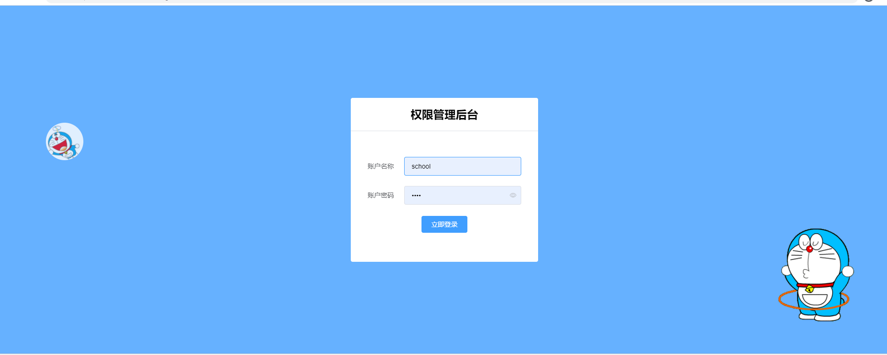
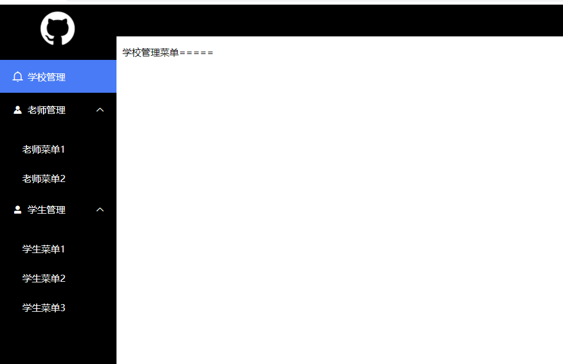
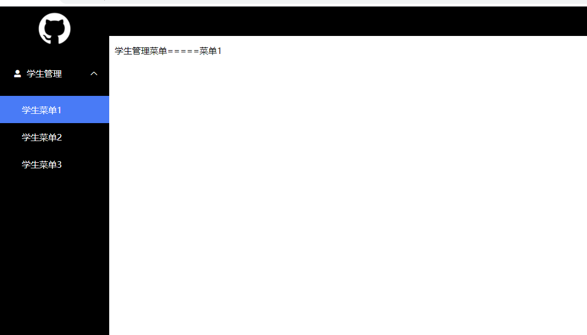

# 一个纯静版的后台权限管理模板

###账号说明 school这个账号是所有菜单都会有

其他账号(任意填写),只有一个学生管理菜单

账号密码不做任何验证，不填账号密码登陆进去的就是其他账号





## Project setup
```
npm install
```

### Compiles and hot-reloads for development
```
npm run serve
```

### Compiles and minifies for production
```
npm run build
```

### Lints and fixes files
```
npm run lint
```

### Customize configuration
See [Configuration Reference](https://cli.vuejs.org/config/).


